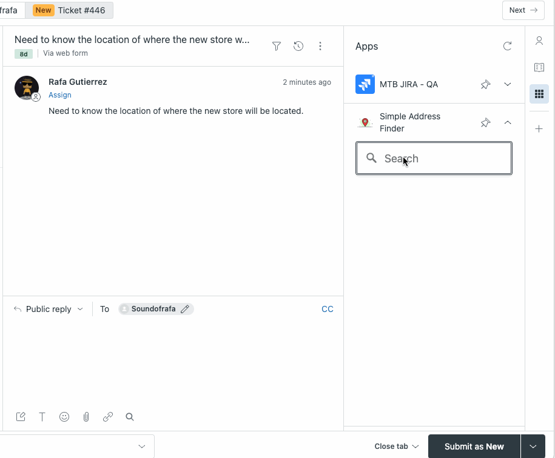
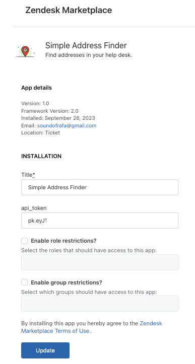
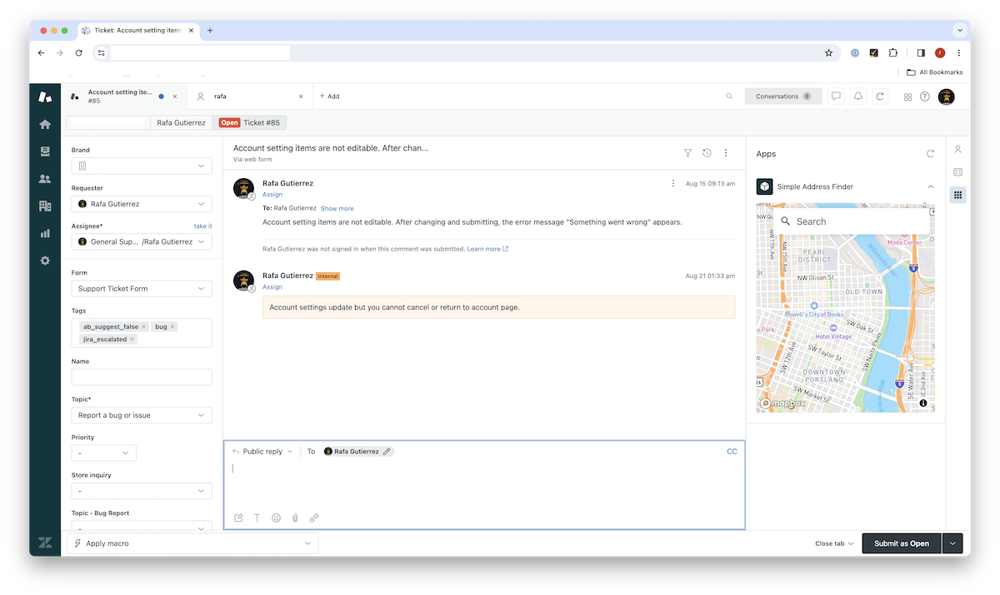

# Simple Address Finder

Use the [Mapbox Geocoder](https://docs.mapbox.com/api/search/geocoding/) to find addresses and display the location on a map.

### Usage:

1. Install ZAT or the Zendesk CLI: https://developer.zendesk.com/documentation/apps/zendesk-app-tools-zat/installing-and-using-zat/
2. Clone this repository and `cd` into the directory
3. Run `zat server` to start a local server
4. Add your Mapbox access token available at https://account.mapbox.com/access-tokens/
5. Open a ticket in Zendesk and append `?zat=true` to the URL
6. Click the app icon in the sidebar to open the app
7. Type an address in the search box and hit 'Return' to open the map and display the location
8. Click `⬅️ Add Map` to add the map to the ticket comment. The map will be added as an image attachment using Mapbox's Static API. 

**Note:** The Geocoding and Static API requests will be charged to your Mapbox account so make sure you understand the pricing: 
- https://docs.mapbox.com/accounts/guides/pricing/#search-related-apis
- https://docs.mapbox.com/api/maps/static-images/#static-images-api-pricing

### Publishing
When publishing your app, use `zat package` to create a tepmorary zip file. Then, upload the zip file to the Zendesk Marketplace as a private app. Note, you will need to go to the Settings for the app to add your Mapbox access token.

Please submit bug reports to [soundofrafa@gmail.com](mailto:soundofrafa@gmail.com). Pull requests are welcome.

### Screenshot(s):

### Troubleshooting
In some cases, you may find that the server is still running in the background after you stop the server. You can use the following commands to find the process ID and kill the process:
- `lsof -i :4567`
- `kill -quit <PID>`

The app will add additional images to the comments if you click `⬅️ Add Map` after multiple searches. You can delete the images from the comment before submitting the ticket.
